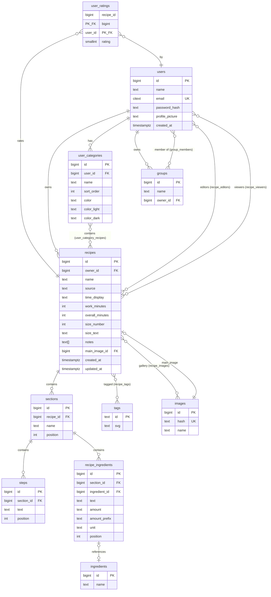

# 04 - Database Layout (PostgreSQL)

This document defines the PostgreSQL schema for Foodly. It is derived from the
domain models in [03_Data_Models.md](03_Data_Models.md) and serves the API
described in [02_API_Design.md](02_API_Design.md).

---

## Conventions

- **Naming**: `snake_case` for all tables, columns, and constraints.
- **Primary keys**: `BIGINT GENERATED ALWAYS AS IDENTITY` (auto-increment, 64-bit). Referred to as `BIGINT` in FK columns.
- **Timestamps**: `TIMESTAMPTZ NOT NULL DEFAULT now()`. Always stored in UTC.
- **Soft deletes**: Not used. Deletes are hard deletes with `ON DELETE CASCADE` where appropriate.
- **Text**: `TEXT` (unbounded) unless a specific max length is enforced.
- **Arrays**: PostgreSQL native arrays (`TEXT[]`, `BIGINT[]`) are used sparingly, only for truly flat value lists that will never need per-element metadata (e.g. `recipe.notes`). Anything that may gain columns later gets its own table from the start.

---

## Extensions

```sql
CREATE EXTENSION IF NOT EXISTS "citext";   -- case-insensitive text (for email)
CREATE EXTENSION IF NOT EXISTS "pgcrypto"; -- gen_random_uuid() for WS tickets
```

---

## Tables

### `users`

```sql
CREATE TABLE users (
    id              BIGINT GENERATED ALWAYS AS IDENTITY PRIMARY KEY,
    name            TEXT        NOT NULL,
    email           CITEXT      NOT NULL UNIQUE,
    password_hash   TEXT        NOT NULL,
    profile_picture TEXT,                          -- content hash; NULL = no picture
    created_at      TIMESTAMPTZ NOT NULL DEFAULT now()
);

CREATE INDEX idx_users_name_trgm ON users USING gin (name gin_trgm_ops);
```

> The trigram index on `name` powers the `GET /api/v1/users/search?q=...` endpoint (substring/prefix matching). Requires `CREATE EXTENSION IF NOT EXISTS "pg_trgm";`.

---

### `refresh_tokens`

```sql
CREATE TABLE refresh_tokens (
    id         BIGINT GENERATED ALWAYS AS IDENTITY PRIMARY KEY,
    user_id    BIGINT      NOT NULL REFERENCES users(id) ON DELETE CASCADE,
    token_hash TEXT        NOT NULL UNIQUE,  -- hash of the refresh token (never store raw)
    expires_at TIMESTAMPTZ NOT NULL,
    created_at TIMESTAMPTZ NOT NULL DEFAULT now()
);

CREATE INDEX idx_refresh_tokens_user ON refresh_tokens(user_id);
```

---

### `ws_tickets`

Short-lived, one-time tickets for WebSocket authentication.

```sql
CREATE TABLE ws_tickets (
    id         BIGINT GENERATED ALWAYS AS IDENTITY PRIMARY KEY,
    user_id    BIGINT      NOT NULL REFERENCES users(id) ON DELETE CASCADE,
    ticket     UUID        NOT NULL UNIQUE DEFAULT gen_random_uuid(),
    expires_at TIMESTAMPTZ NOT NULL,
    used       BOOLEAN     NOT NULL DEFAULT false
);

CREATE INDEX idx_ws_tickets_ticket ON ws_tickets(ticket);
```

> Expired/used tickets are cleaned up periodically by a background job.

---

### `tags`

```sql
CREATE TABLE tags (
    id  TEXT PRIMARY KEY,    -- the display name IS the id (e.g. 'Hauptgericht')
    svg TEXT                 -- hash/filename of optional SVG icon; NULL = no icon
);
```

> Tags are a fixed, server-curated catalog. `id = name` is a deliberate
> simplification — see Open Questions in 03_Data_Models.md for the renaming caveat.

---

### `ingredients`

```sql
CREATE TABLE ingredients (
    id   BIGINT GENERATED ALWAYS AS IDENTITY PRIMARY KEY,
    name TEXT NOT NULL
);
```

> Global catalog, curated server-side. Users cannot add entries.

---

### `images`

```sql
CREATE TABLE images (
    id   BIGINT GENERATED ALWAYS AS IDENTITY PRIMARY KEY,
    hash TEXT NOT NULL UNIQUE,   -- content hash = filename on disk
    name TEXT                     -- optional display name
);
```

> The actual image binary lives on disk at `<storage_root>/<hash[0:2]>/<hash[2:4]>/<hash>`.

---

### `recipes`

```sql
CREATE TABLE recipes (
    id               BIGINT GENERATED ALWAYS AS IDENTITY PRIMARY KEY,
    owner_id         BIGINT      NOT NULL REFERENCES users(id) ON DELETE CASCADE,
    name             TEXT        NOT NULL,
    source           TEXT,
    time_display     TEXT,                        -- human-readable (e.g. "45 min {Kochzeit}")
    work_minutes     INT,
    overall_minutes  INT,
    size_number      INT,                         -- editable portion count; NULL = fixed descriptor
    size_text        TEXT,                         -- TagText label (e.g. "{Portionen}")
    notes            TEXT[]      NOT NULL DEFAULT '{}',
    main_image_id    BIGINT      REFERENCES images(id) ON DELETE SET NULL,
    created_at       TIMESTAMPTZ NOT NULL DEFAULT now(),
    updated_at       TIMESTAMPTZ NOT NULL DEFAULT now()
);

CREATE INDEX idx_recipes_owner ON recipes(owner_id);
```

> `updated_at` is bumped only on **content** changes (name, sections, ingredients, etc.) — not on permission/sharing changes.

---

### `recipe_tags`

Junction table for the many-to-many relationship between recipes and tags. Preserves order.

```sql
CREATE TABLE recipe_tags (
    recipe_id  BIGINT NOT NULL REFERENCES recipes(id) ON DELETE CASCADE,
    tag_id     TEXT   NOT NULL REFERENCES tags(id) ON DELETE CASCADE,
    position   INT    NOT NULL DEFAULT 0,

    PRIMARY KEY (recipe_id, tag_id)
);
```

---

### `recipe_images`

Gallery images for a recipe (excludes `main_image_id`). Preserves order.

```sql
CREATE TABLE recipe_images (
    recipe_id BIGINT NOT NULL REFERENCES recipes(id) ON DELETE CASCADE,
    image_id  BIGINT NOT NULL REFERENCES images(id) ON DELETE CASCADE,
    position  INT    NOT NULL DEFAULT 0,

    PRIMARY KEY (recipe_id, image_id)
);
```

---

### `recipe_editors`

```sql
CREATE TABLE recipe_editors (
    recipe_id BIGINT NOT NULL REFERENCES recipes(id) ON DELETE CASCADE,
    user_id   BIGINT NOT NULL REFERENCES users(id)   ON DELETE CASCADE,

    PRIMARY KEY (recipe_id, user_id)
);

CREATE INDEX idx_recipe_editors_user ON recipe_editors(user_id);
```

---

### `recipe_viewers`

```sql
CREATE TABLE recipe_viewers (
    recipe_id BIGINT NOT NULL REFERENCES recipes(id) ON DELETE CASCADE,
    user_id   BIGINT NOT NULL REFERENCES users(id)   ON DELETE CASCADE,

    PRIMARY KEY (recipe_id, user_id)
);

CREATE INDEX idx_recipe_viewers_user ON recipe_viewers(user_id);
```

> The index on `user_id` is critical: the `GET /api/v1/recipes` endpoint queries "all recipes where user is owner OR editor OR viewer", which requires efficient lookup by user across all three roles.

---

### `sections`

```sql
CREATE TABLE sections (
    id        BIGINT GENERATED ALWAYS AS IDENTITY PRIMARY KEY,
    recipe_id BIGINT NOT NULL REFERENCES recipes(id) ON DELETE CASCADE,
    name      TEXT,
    position  INT    NOT NULL DEFAULT 0
);

CREATE INDEX idx_sections_recipe ON sections(recipe_id);
```

---

### `steps`

Instruction steps within a section. Stored as their own rows so that per-step metadata (e.g. `duration` for recipe-linked timers) can be added later with a simple `ALTER TABLE ADD COLUMN` — no data migration required.

```sql
CREATE TABLE steps (
    id         BIGINT GENERATED ALWAYS AS IDENTITY PRIMARY KEY,
    section_id BIGINT NOT NULL REFERENCES sections(id) ON DELETE CASCADE,
    text       TEXT   NOT NULL,          -- the instruction text
    position   INT    NOT NULL DEFAULT 0
    -- future: duration INT  (seconds, for recipe-linked timers)
);

CREATE INDEX idx_steps_section ON steps(section_id);
```

---

### `recipe_ingredients`

```sql
CREATE TABLE recipe_ingredients (
    id            BIGINT GENERATED ALWAYS AS IDENTITY PRIMARY KEY,
    section_id    BIGINT NOT NULL REFERENCES sections(id) ON DELETE CASCADE,
    ingredient_id BIGINT REFERENCES ingredients(id) ON DELETE SET NULL,  -- NULL = freetext line
    text          TEXT,               -- suffix after ingredient name, OR standalone freetext
    amount        TEXT,               -- quantity as string (e.g. "500", "2-3")
    amount_prefix TEXT,               -- prefix before amount (e.g. "ca.")
    unit          TEXT,               -- unit string (e.g. "g", "EL")
    position      INT    NOT NULL DEFAULT 0
);

CREATE INDEX idx_recipe_ingredients_section ON recipe_ingredients(section_id);
```

> `ingredient_id` uses `ON DELETE SET NULL`: if a catalog ingredient is ever
> removed, the recipe line degrades to freetext rather than being deleted.

---

### `user_ratings`

```sql
CREATE TABLE user_ratings (
    recipe_id BIGINT NOT NULL REFERENCES recipes(id) ON DELETE CASCADE,
    user_id   BIGINT NOT NULL REFERENCES users(id)   ON DELETE CASCADE,
    rating    SMALLINT NOT NULL CHECK (rating >= 1 AND rating <= 5),

    PRIMARY KEY (recipe_id, user_id)
);
```

> Ratings are embedded in the recipe response as `recipe.rating[]`. This table is
> never directly exposed via the API as a standalone resource.

---

### `user_categories`

```sql
CREATE TABLE user_categories (
    id          BIGINT GENERATED ALWAYS AS IDENTITY PRIMARY KEY,
    user_id     BIGINT NOT NULL REFERENCES users(id) ON DELETE CASCADE,
    name        TEXT   NOT NULL,
    sort_order  INT,                         -- position among the user's categories
    color       TEXT   NOT NULL,             -- primary hex color (e.g. "#e11d48")
    color_light TEXT,                        -- optional light-mode override
    color_dark  TEXT                         -- optional dark-mode override
);

CREATE INDEX idx_user_categories_user ON user_categories(user_id);
```

---

### `user_category_recipes`

Ordered assignment of recipes to a user's category.

```sql
CREATE TABLE user_category_recipes (
    category_id BIGINT NOT NULL REFERENCES user_categories(id) ON DELETE CASCADE,
    recipe_id   BIGINT NOT NULL REFERENCES recipes(id)         ON DELETE CASCADE,
    position    INT    NOT NULL DEFAULT 0,

    PRIMARY KEY (category_id, recipe_id)
);
```

---

### `groups`

```sql
CREATE TABLE groups (
    id       BIGINT GENERATED ALWAYS AS IDENTITY PRIMARY KEY,
    name     TEXT   NOT NULL,
    owner_id BIGINT NOT NULL REFERENCES users(id) ON DELETE CASCADE
);

CREATE INDEX idx_groups_owner ON groups(owner_id);
```

---

### `group_members`

```sql
CREATE TABLE group_members (
    group_id BIGINT NOT NULL REFERENCES groups(id) ON DELETE CASCADE,
    user_id  BIGINT NOT NULL REFERENCES users(id)  ON DELETE CASCADE,

    PRIMARY KEY (group_id, user_id)
);

CREATE INDEX idx_group_members_user ON group_members(user_id);
```

> The index on `user_id` supports `GET /api/v1/groups` (list groups where user
> is owner **or** member).

---

## Entity-Relationship Diagram



---

## Key Queries & Index Rationale

### "List all recipes accessible to a user"

The most important query. Needs to UNION across three access paths:

```sql
SELECT r.* FROM recipes r WHERE r.owner_id = $1
UNION
SELECT r.* FROM recipes r JOIN recipe_editors re ON r.id = re.recipe_id WHERE re.user_id = $1
UNION
SELECT r.* FROM recipes r JOIN recipe_viewers rv ON r.id = rv.recipe_id WHERE rv.user_id = $1
ORDER BY ...
LIMIT $2;
```

**Indexes used:** `idx_recipes_owner`, `idx_recipe_editors_user`, `idx_recipe_viewers_user`.

### "Search users by name"

```sql
SELECT id, name, profile_picture
FROM users
WHERE id != $1                     -- exclude self
  AND name ILIKE '%' || $2 || '%'  -- or use similarity() with pg_trgm
LIMIT $3;
```

**Index used:** `idx_users_name_trgm` (GIN trigram index for efficient substring search).

### "List groups where user is owner or member"

```sql
SELECT g.* FROM groups g WHERE g.owner_id = $1
UNION
SELECT g.* FROM groups g JOIN group_members gm ON g.id = gm.group_id WHERE gm.user_id = $1;
```

**Indexes used:** `idx_groups_owner`, `idx_group_members_user`.

---

## Migration Strategy

Migrations are managed via **SQLx's migration system** (`sqlx migrate`), stored in `src/db/migrations/` as sequentially numbered `.sql` files:

```
src/db/migrations/
├── 001_create_users.sql
├── 002_create_tags_and_ingredients.sql
├── 003_create_images.sql
├── 004_create_recipes.sql
├── 005_create_sections.sql
├── 006_create_steps.sql
├── 007_create_recipe_ingredients.sql
├── 008_create_permissions.sql
├── 009_create_ratings.sql
├── 010_create_categories.sql
├── 011_create_groups.sql
├── 012_create_auth_tokens.sql
```

Each migration is idempotent (`IF NOT EXISTS` where applicable) and runs in a transaction.
